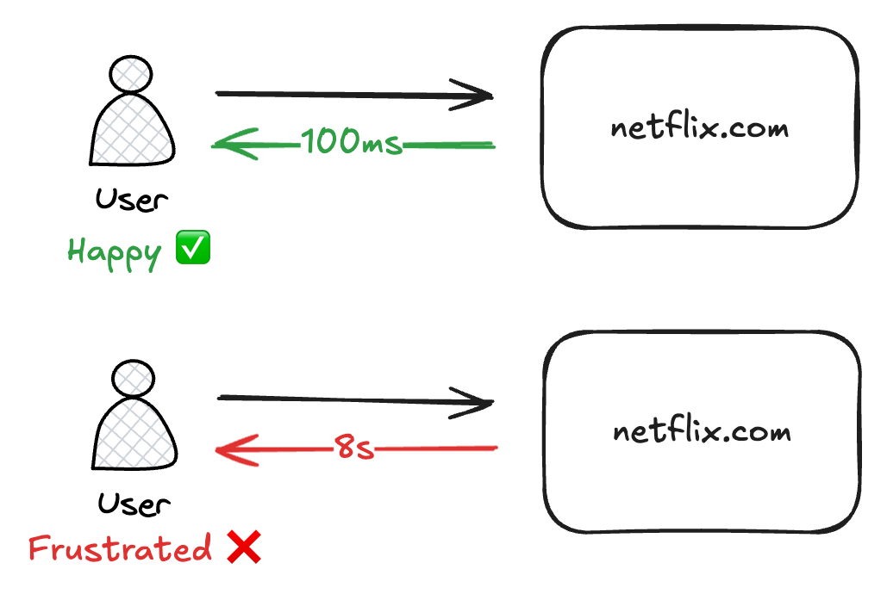
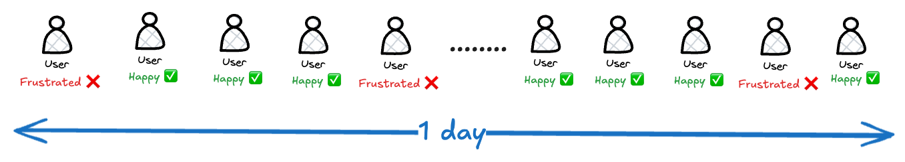
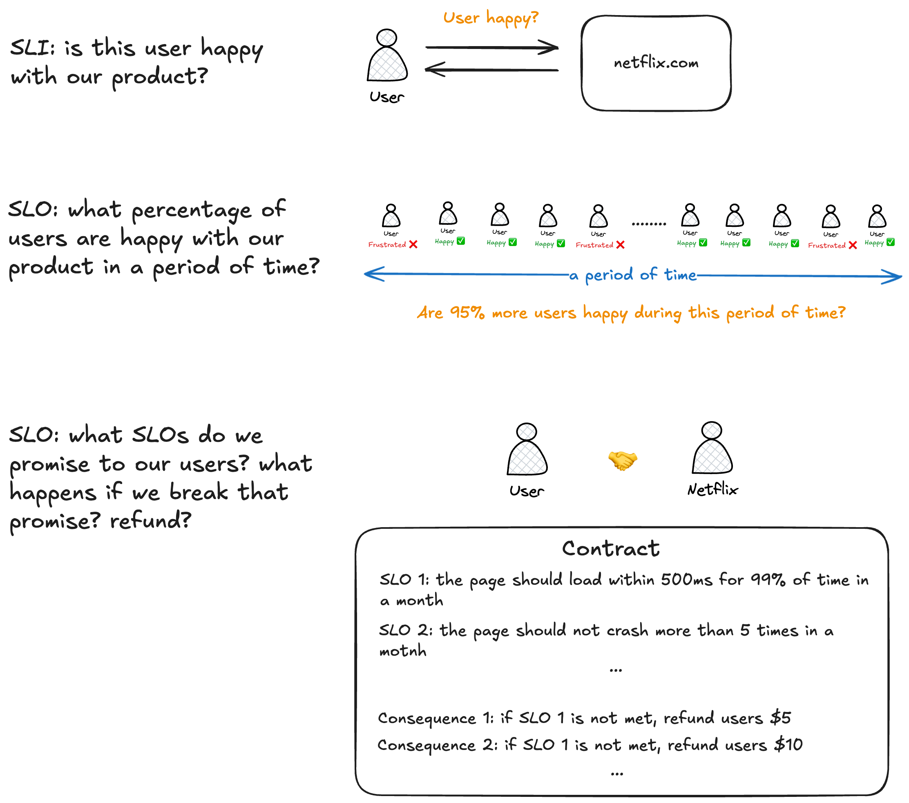

When building and running software products, one big question always comes up: **how do we know if what we’ve built is actually working well for our users?**

Whether it’s a streaming service like Netflix or any other app, keeping users happy and delivering a good experience is key. But how do we measure that, and how do we make sure we’re meeting our goals?

That’s where concepts like **Service Level Indicator (SLI)**, **Service Level Objective (SLO)**, and **Service Level Agreement (SLA)** come in. Let’s break down what these terms really mean—and how they fit into the bigger picture.

We build software products for people to use, and we want them to enjoy using our products. If people like our products, they’ll keep using them—and we’ll keep getting paid. But how do we actually know if our customers are happy?

It’s hard to measure happiness directly, but there are clues we can follow—signals that indicate whether users are having a good experience.

Take, for example, a customer visiting [netflix.com](http://netflix.com/). If the website takes 8 seconds to load, that’s frustrating. But if it loads instantly, they’re probably pleased. In this case, the time it takes for the website to load (latency) is one indicator of customer happiness.

But page load speed isn’t the only thing that matters. If you’re watching a movie and the video keeps pausing to buffer, that’s annoying. If you try to search for a show and the search doesn’t work, or if you can’t even log in, those are all negative experiences. Each of these can be measured—video playback smoothness, search reliability, login success rate—all are useful indicators of how happy customers are.

There are plenty of other signals too, like whether the site is down or crashes unexpectedly. All these measurements help us estimate how well we’re serving our users.

We call these measurements **Service Level Indicator (SLI)**. **An SLI is a specific metric that tells us whether a customer’s experience is good or bad.**

However, an SLI only tells us how things went at a specific moment in time. Since our products are used by many people, all the time, and things are sometimes fast and sometimes slow, we also want a bigger-picture view—over a day, a week, a month, or a year.

Suppose we track customer happiness every time someone uses our product throughout the day.

Let’s say we see that 7 out of 10 customers are happy. Not bad, but we want to do better. So we set a goal: tomorrow, we want 9 out of 10 to be happy.

This goal is called a **Service Level Objective (SLO)**—**it’s the target we set for what percentage of users should have a good experience over a period of time.** SLOs are usually decided by the product, engineering, and reliability teams together. They look at what matters most to users, business needs, and what’s technically possible. Often, teams also review industry standards or benchmarks before setting SLOs.

Setting SLOs helps everyone on the team know what “success” looks like. When you have a clear target, it’s much easier to focus your efforts and track progress.

But goals aren’t always enough, especially when money is involved. Because customers pay us, they want guarantees. For example, they may expect the website to be fast 99% of the time. They’ll only pay if we agree to meet that target. And if we fail—say the site is down for 5 days in a month—they expect compensation, such as refunds or credits.

This formal promise is called a **Service Level Agreement (SLA)**. **An SLA is a contract between two parties—usually the company providing the service and its customer (which can be an individual user, another business, or a partner).** It clearly defines what the provider commits to (like uptime or performance), and what the customer can expect. In other words, an SLA locks in a specific SLO, with legal or financial consequences if we don’t meet it.

Essentially: **SLA = SLO + legal/financial accountability**

To wrap it up: SLIs, SLOs, and SLAs aren’t just fancy buzzwords. They’re simple tools that help us understand if people actually enjoy using our products and if we’re living up to what we promised.

- **Service Level Indicators (SLIs)** are the numbers we measure that tell us how well our product is doing (like how fast a page loads) at a given moment.
- **Service Level Objectives (SLOs)** are the goals we set for ourselves for those SLIs over a period of time—like “we want 99% of people to be happy with our website in the last 3 months.”
- **Service Level Agreements (SLAs)** are the formal promises we make to our customers—if we break them, there are real consequences.

