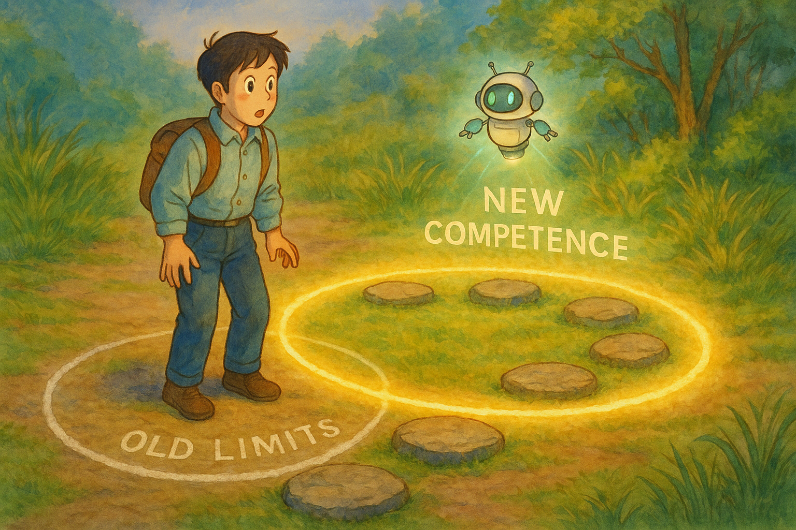
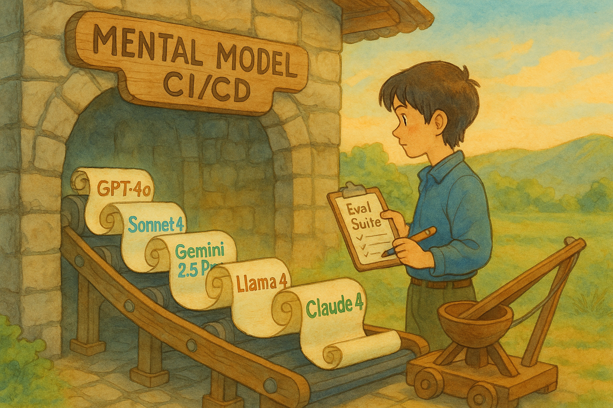
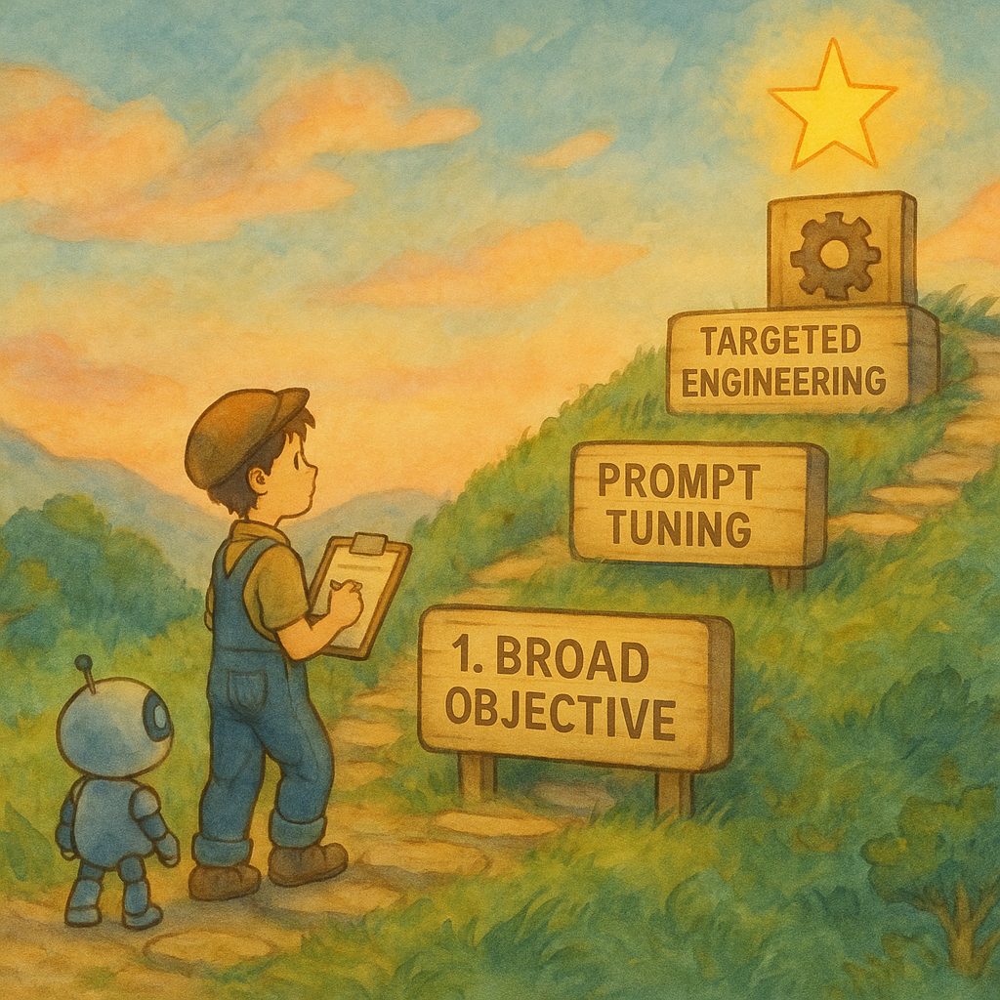

> ***"We shape our tools and thereafter our tools shape us."* — Marshall McLuhan**
>

📝 **TL;DR**

- **Treat your mental model like a CI/CD pipeline:** Use personal evals on new AI releases to keep your "mental OS" current, not outdated.
- **Avoid premature constraints on agents:** Before over-engineering or meticulously planning for them, Test agents broadly first to discover their true capabilities and avoids building around limitations that may no longer exist.
- **Evals are your North Star:** Map an agent's "circle of competence" via broad tests, then apply escalating control (prompt, guide, targeted engineer) for verified gaps only.
- **Grow with the models:** Ship lean V1s; let future AI upgrades boost reliability. Build for the curve, not just today's limits.
- **Embrace an AI-native paradigm:** AI is probabilistic and adaptive. To invent truly AI-native products, we must redesign tools—and our own thinking—from first principles to fully leverage AI's evolving capabilities.

*Disclaimer: For this post, I use 'LLMs' and 'agents' (or 'AI agents') interchangeably[^1].*

## The Demo That Shattered My Assumptions

Last week, Will and I gave a talk at the AI Tinkerers London meetup called: **"Turn Any Agentic IDE into Lovable/Bolt with Just One MCP."**

We did a live demo showing that, by simply adding one MCP ([Model Context Protocol](https://modelcontextprotocol.io/introduction)) server to Cursor—a coding agent— we transformed it into a DevOps agent (or VibeOps agent?). With this enhancement, it completed all of the following from a single prompt:

- create a new GitHub repo
- push freshly generated code
- create and deploy a Vercel project
- configure DNS records on Cloudflare
- send the live URL via Gmail

It was completely hands-free, requiring no clicks, follow-up prompts, or any human input.

We also have a short clip of the demo here:

What's wild is that it didn't just work during the demo, it worked flawlessly every single time I tested it beforehand. And we hadn't done anything fancy or hacky; we simply dropped in the MCP server and ran it. That was it.

At the end of the talk, someone asked, "**When did you realize this was possible?**"

That question hit me.

Because honestly? I didn't think it was possible. Not really.

When I first started preparing for the demo, I assumed the agent wouldn't be able to handle all those steps on its own, so I split the flow into parts that I believed were small enough for the LLM to solve, and then stitch everything together manually—or with glue code. I figured I'd need to guide it, double-check everything, maybe even step in and fix things mid-run.

But when Will asked me to just try it as one big prompt—just to see what happens—it worked. Not just once, but consistently. And looking back, I think it's been possible for a while. I just never tried it because I didn't believe the agent could break down the problem, plan out its actions, and execute them seamlessly.

That hesitation came from an outdated mental model. My intuition about the agent's actual **circle of competence**—**the true scope of tasks it could reliably handle**—was stuck in the past. I had been designing workflows around limitations that no longer existed.

That's when I realized: the real limitation wasn't the model or the agent. It was my outdated perception of its capabilities.

## The Core Problem: Cognitive Latency

> **"The illiterate of the 21st century will not be those who cannot read and write, but those who cannot learn, unlearn, and relearn."** **— *Alvin Toffler***
>

In trying to understand this disconnect, I stumbled upon a term that perfectly encapsulated my experience: **cognitive latency**. It's a human tendency for beliefs and intuitions to evolve more slowly than the systems we are interacting with.

With AI's rapid progress, cognitive latency becomes a significant obstacle, preventing us from fully leveraging current capabilities.

Advancements in models, agents, and the surrounding infrastructure mean that **tasks once considered too complex for AI are now well within reach**. But because our mental models lag behind, we continue to underestimate what these systems can actually do. **We fail to accurately perceive their current 'circle of competence'—the ever-expanding range and complexity of tasks they can undertake.**

AI progress feels effortless because it happens without our direct input, but updating our mental models about their evolving circle of competence? That's the opposite. It takes deliberate, repeated effort. And it needs to happen fast and often, which makes it even harder.

After reflecting on all this, I wrote down the mistakes I made—the cognitive traps I fell into—and how I plan to overcome them with a new set of mindsets.

## Recalibrating Mental Models for the Age of AI

The arrival of the Age of AI isn't just about new tools; it demands a fundamental recalibration of our mental models. I learned it the hard way, but here's what I plan to do.

### Treat Your Mental Model Like a CI/CD Pipeline

If our mental model for AI is going to keep pace, we must treat it like a CI/CD pipeline, where new developments automatically trigger the integration, testing, and deployment of an updated understanding. I learned this lesson when my own 'pipeline' stalled, leaving me trapped applying outdated intuitions from older models to the newer ones I'm using now.

In the rapidly evolving field of AI, what's considered SOTA (state of the art) today may be outdated tomorrow. In just the past few months, we've seen an explosion of new releases—Gemini 2.5 Pro, Sonnet 3.7, the Llama 4 models, and now the Claude 4 family. Most of these models have built-in reasoning and extended thinking capabilities.

And it's not just the models that are improving, agents are evolving too. Tools like Cursor and Windsurf have added web search, terminal access, persistent memory, and more. MCP takes things even further by enabling virtually unlimited ways to extend and enhance what agents can do. The circle of competence of those models and agents almost doubled or even tripled in the past six months.

But when I was preparing for the demo, my mental model was still stuck on an old "build" based on GPT-4o, which doesn't have much planning and reasoning capability. Meanwhile, the "latest version" I was actually using, Claude Sonnet 4, had a vastly expanded circle of competence that my "pipeline" hadn't processed.

To overcome this, we need to make a habit of running our mental model "pipeline" frequently. That means staying current with the major updates, but more importantly, testing things yourself. There are plenty of posts on social platforms like X comparing models when new ones come out, and those are great for a high-level view. **But nothing replaces hands-on experience when it comes to building intuition.**

I recommend **keeping a short list of tasks as your own personal eval set**—it's your dedicated "test suite" for your mental model pipeline, things that matter to your personal workflows. For example, if you are a game developer, you may have a prompt for generating a complex game to test different models. I care the most about tool use, so I'll have a prompt to ask the models to do some multi-turn tool use tasks to see how they perform.

Then every time a new model or significant agent feature drops, run your eval set against it. Official benchmarks are helpful too, but I've found them hard to translate into the kinds of things I actually do day to day. For me, trying things out directly is the best way to keep my mental model aligned with reality.

### Let Evals And Benchmarks Be Our North Star

Working with today's rapidly evolving AI agents often leads to two common pitfalls: we either over-control them, treating them like traditional deterministic software, or we underestimate their capabilities due to past experiences. Both approaches hinder our ability to build truly agentic systems and leverage the full potential of new models. The key is to let systematic evaluation—our North Star—define an agent's true "circle of competence" and guide how we interact with and build around it.

#### The Pitfall of Premature Constraints

Many of us, myself included, carry habits from traditional software development. Our instinct can be to over-control AI agents, meticulously planning each step and pre-solving parts of the problem. While this often comes from a good place—enjoying problem-solving or ensuring reliability—it can become a form of **premature optimization** when applied to modern agents. We risk building elaborate scaffolding around limitations that may no longer exist, effectively preventing the agent from demonstrating its full capabilities.

#### First, Benchmark Broadly to Define the True "Circle of Competence"

Having established the pitfall of premature constraints, your "North Star"—evaluation—points to the vital first step: assess its capabilities broadly. This initial assessment isn't about deploying with blind trust; rather, it simply means giving the agent a whole complex task (or a large, representative part of it) in a safe test environment.

My own demo proved this strategy's power: the agent flawlessly handled a multi-step DevOps workflow once I presented the entire challenge. That single test was key, revealing a "circle of competence" far larger than I'd imagined. Such upfront, expansive testing maps the agent's true current frontier.

#### An Escalating Approach to Control, Guided by Evals (Credits to Will)

Once your evaluations provide this baseline map of what the agent can reliably achieve on its own, you can apply a more nuanced and efficient **"escalating control" strategy**. This ensures that any intervention is targeted, data-driven, and genuinely necessary:

1. **Start with the Broad Objective:** Define the overall goal clearly and provide well-crafted, but initially high-level, prompts. Run your eval set. Observe where the agent excels in planning and execution, and pinpoint precisely where it falters or requires support.
2. **Iterate with Guided Prompting:** If the initial broad approach reveals specific weaknesses (e.g., in multi-step reasoning, tool selection, or handling edge cases), the next level of intervention is more detailed prompt engineering. Refine your prompts to offer clearer guidance, structure its chain-of-thought, or provide more context for those problematic sub-tasks. Then, re-evaluate.
3. **Implement Targeted Engineering as a Final Step:** Only if iterative prompting and consistent evaluation demonstrate that the agent fundamentally cannot overcome a specific, critical hurdle should you introduce custom code, specialized tools, or more rigid traditional logic for that segment.

This data-driven, escalating approach means **any intervention you apply** is informed and deliberate, used only where your "North Star"—the evidence from your evaluations—confirms it's essential.

### Grow With the Models

Many engineers like me tend to obsess over reliability—and to be fair, that's usually a good thing. But when it comes to building on top of LLMs, that obsession can limit our imagination. LLMs are stochastic systems, and the applications built on top of them are inherently not going to be perfectly reliable. This is very different from traditional deterministic software—once a code path is thoroughly tested and it works, it'll keep working consistently unless there's a bug.

Fortunately, as models get better, the reliability and correctness of their outputs are improving rapidly too, and we can also add guardrails. So when building agentic applications, the key mindset is this: **don't obsess over perfection, focus on growing with the model.**

If you have a good idea in mind, don't throw it away just because you can't make it fully capable or reliable today. Instead, try building a simplified version with what the model can currently do. Then, as the model improves, gradually expand your app's capabilities alongside it.

Sam Altman put it well: instead of patching or artificially extending a model's abilities, developers should design applications that evolve with the model's progress. For example, an educational app might start with elementary-level content and progressively add more advanced material as the model becomes more proficient.

Even if what you're building today only works 3 out of 10 times, that doesn't mean it's a bad idea. If the model keeps improving, your app will naturally improve with it. Don't get discouraged—**build for the curve, not just for the moment.**

## **Shift Your Paradigm to Build What's Next**

AI isn't just another technology—it's a paradigm shift. Traditional software is deterministic: reliable, but rigid. It executes only the workflows explicitly defined by programmers. AI systems, on the other hand, are probabilistic and adaptive, capable of tackling tasks and workflows we haven't explicitly programmed. That flexibility marks a fundamental change in how we build and interact with software.

This shift unlocks entirely new categories of products that were previously unimaginable. But to invent and build truly AI-native applications, we have to start by shifting our own mindsets.
I deeply believe that in the age of AI, every tool and application we use needs to be reimagined—and rebuilt from the ground up—to be AI-native. That means thinking from first principles, questioning long-held assumptions, and embracing design paradigms that fully leverage AI's evolving capabilities.

So let's be bold, be audacious, and go take on the world with our ideas. The age of agentic AI is just beginning, and the landscape is wide open.

> 💡 If you want to try it out yourself, follow the blog post Will wrote here:
> 👉 [VibeOps:Turn Cursor into Lovable — Close the Dev Loop with a Single MCP](https://www.aci.dev/blog/vibeopsturn-cursor-into-lovable-close-the-dev-loop-with-a-single-mcp)

[^1]: AI agents are applications built on top of LLMs that perceive their environment, make autonomous decisions, and take actions to achieve specific goals. e.g. Cursor and Windsurf are coding agents. If you are unfamiliar with the concept, you can refer to [LLM Powered Autonomous Agents](https://lilianweng.github.io/posts/2023-06-23-agent/) by Lilian Weng.
